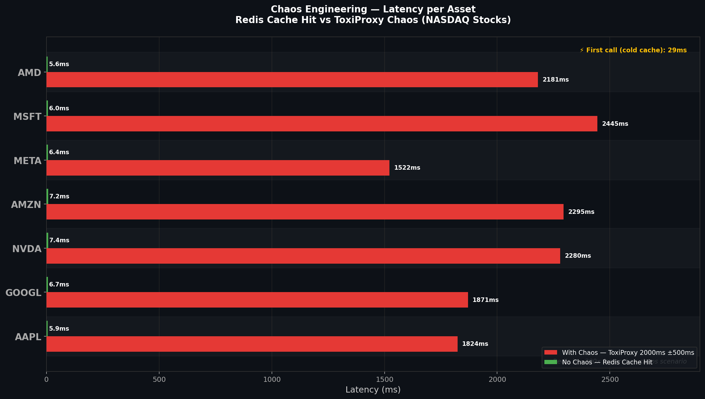

# 📈 Stock Quotes — Chaos Engineering on NASDAQ Stocks

> **When NASDAQ Freezes: Simulating real-world failures with ToxiProxy, Redis, PostgreSQL and Resilience4j**

A Spring Boot application that fetches real-time stock quotes from NASDAQ-listed companies and serves as a **chaos engineering lab** — intentionally injecting latency and failures to observe system behavior under stress.

---

## 🧪 What This Project Demonstrates

- How Redis cache collapses silently when latency is injected
- How a Circuit Breaker opens and blocks calls automatically under chaos
- The difference between a **6ms Redis hit** and a **2400ms degraded response**
- How ToxiProxy intercepts and degrades real network traffic between services

---

## 🏗️ Architecture

```
Client
  └─► Nginx (port 8000/20000)
        └─► Backend (Spring Boot :8080)
              ├─► ToxiProxy :20001 ──► PostgreSQL :5432
              ├─► ToxiProxy :20002 ──► Redis :6379
              └─► ToxiProxy :20003 ──► finnhub.io:443 (via Nginx)
```

**ToxiProxy sits between every service** — allowing latency, jitter, bandwidth limits and connection resets to be injected at any time without touching application code.

---

## 🛠️ Tech Stack

| Layer | Technology |
|---|---|
| Language | Java 21 |
| Framework | Spring Boot 4 |
| Cache | Redis 7 (via Spring Cache + Lettuce) |
| Database | PostgreSQL 17 |
| Resilience | Resilience4j (Circuit Breaker + Retry) |
| Chaos | ToxiProxy |
| Reverse Proxy | Nginx |
| Market Data | Finnhub API |
| Containerization | Docker + Docker Compose |

---

## 📊 Measured Results




| Scenario | Latency |
|---|---|
| First call — cold cache | ~29ms |
| Redis cache hit — no chaos | ~6ms |
| With chaos (2000ms ±500ms latency) | ~1500–2500ms |
| Circuit Breaker OPEN — fallback | ~5ms |

> Redis is ~300x faster than the chaos scenario. When the Circuit Breaker opens, the fallback is faster than a normal cache hit.

---

## 🚀 Getting Started

### Prerequisites

- Docker and Docker Compose
- A free [Finnhub API key](https://finnhub.io)

### 1. Clone and configure

```bash
git clone https://github.com/Doug16Yanc/stock-quotes.git
cd stock-quotes
cp .env-example .env
# Fill in your Finnhub token and database credentials in .env
```

### 2. Start infrastructure

```bash
docker compose up -d postgres redis toxiproxy
```

### 3. Configure ToxiProxy proxies

```bash
./scripts/setup-toxiproxy.sh
```

### 4. Start the application

```bash
docker compose up -d backend nginx
```

### 5. Test it

```bash
curl http://localhost:8080/api/v1/stock-quotes/get-by-symbol/AAPL
```

---

## 💥 Chaos Scenarios

### Inject latency (2000ms ±500ms on all services)

```bash
./scripts/inject-chaos.sh
```

### Remove chaos

```bash
./scripts/remove-chaos.sh
```

### Monitor Circuit Breaker state

```bash
curl http://localhost:8080/actuator/circuitbreakers | jq
```

Expected output under chaos:

```json
{
  "circuitBreakers": {
    "financialApi": {
      "bufferedCalls": 3,
      "failedCalls": 0,
      "failureRate": "0.0%",
      "failureRateThreshold": "50.0%",
      "notPermittedCalls": 0,
      "slowCallRate": "100.0%",
      "slowCallRateThreshold": "50.0%",
      "slowCalls": 3,
      "slowFailedCalls": 0,
      "state": "OPEN"
    }
  }
}
```

---

## 🔍 Tracked Stocks

```
AAPL · MSFT · NVDA · TSLA · GOOGL · AMZN · META · JPM · NFLX · AMD · INTC
```

---

## 📁 Project Structure

```
stock-quotes/
├── src/
│   └── main/java/tech/stockquotes/
│       ├── config/
│       │   ├── cache/          # Redis + cache config
│       │   └── resilience/     # Resilience4j Circuit Breaker, Retry, TimeLimiter
│       ├── domain/             # StockQuote entity
│       ├── dto/                # Finnhub API response DTO
|       ├── exception/          # Exception and rest controller advice global
│       ├── mapper/             # Entity mappers
│       ├── repository/         # JPA repository
│       └── service/
│           ├── FinnhubClient.java   # External API client with @CircuitBreaker
│           └── StockQuoteService.java   # Cache + business logic
├── scripts/
│   ├── setup-toxiproxy.sh     # Creates proxies (no chaos)
│   ├── inject-chaos.sh        # Injects 2000ms ±500ms latency
│   └── remove-chaos.sh        # Removes all toxics
├── nginx.conf                 # Reverse proxy + Finnhub SSL termination
└── docker-compose.yml
```

---

## 🔑 Environment Variables

```env
POSTGRESQL_HOST=toxiproxy
POSTGRESQL_PORT=20001
POSTGRESQL_DATABASE=stockquotes
POSTGRESQL_USER=your_user
POSTGRESQL_PASSWORD=your_password

REDIS_HOST=toxiproxy
REDIS_PORT=20002
REDIS_PASSWORD=your_password

FINNHUB_TOKEN=your_finnhub_api_key
```

See `.env-example` for the full list.

---

## 📖 Article

This project was built as the foundation for an article on Dev.to:

**[When NASDAQ Freezes: Chaos Engineering a Stock Quotes API with Java and ToxiProxy](#)**

---

## 📄 License

MIT
